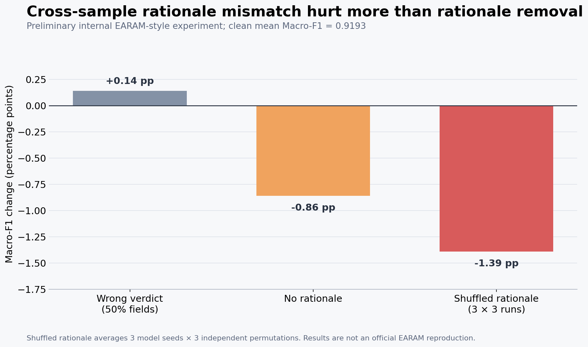

# When Do Rationales Help? A Reliability Stress Test of EARAM-Style Fake-News Detection

## English summary

**Question.** Does an EARAM-style detector actually use sample-specific LVLM rationales, and what
happens when those rationales are missing or assigned to the wrong sample?

**Setup.** We used the 2,558 MR2 training examples for which both public EARAM rationale files are
available. We created stratified 80/10/10 internal splits for model seeds 13, 42, and 97. Frozen
CLIP-Large token features enabled the released VLR architecture to run on an RTX 5060 Laptop GPU
with 8 GB VRAM. Every intervention was evaluated with the clean checkpoint fixed.

| Condition | Mean test Macro-F1 | Change from clean |
|---|---:|---:|
| Clean rationales | 0.9193 | — |
| Incorrect verdict prepended to 50% of rationale fields | 0.9207 | +0.0014 |
| Both rationales removed | 0.9108 | −0.0086 |
| Rationale pairs shuffled across samples | 0.9054 | **−0.0139** |

The shuffled result averages nine evaluations: three independently trained models × three
independent rationale permutations. Mean drops for shuffle seeds 13, 42, and 97 were 0.0116,
0.0129, and 0.0173 respectively.

**Finding.** Cross-sample rationale mismatch is more harmful than removing the rationales entirely,
suggesting that mismatched analysis can weakly mislead the detector. However, a short explicit
incorrect verdict did not reduce performance, so the model does not appear to simply copy a local
conclusion. One possible explanation is that it relies on distributed semantic features or
attenuates the rationale branch during fusion. Because unrestricted shuffling may also alter label-associated signals, within-label
shuffling is required before attributing the drop specifically to semantic misalignment.

**Boundary.** This is a low-memory EARAM-style internal experiment. It is not an official-score
reproduction: the public repository lacks the second official MR2 test rationale, and our split and
cached-feature execution differ from the paper's evaluation. This snapshot publishes the aggregate
metrics and protocol, but the original per-run prediction files were not retained in the repository;
the finding therefore remains preliminary until the runs are archived and independently audited.

## 中文摘要

**问题。** EARAM-style 检测器是否真正使用了与样本匹配的 LVLM 分析？当分析缺失或与样本
错配时，性能会怎样变化？

**实验。** 我们使用两份公开 rationale 均齐全的 2,558 条 MR2 训练数据，按 13、42、97 三个
随机种子构造分层 80/10/10 内部划分。在 8 GB RTX 5060 Laptop GPU 上冻结 CLIP-Large，并用
缓存特征运行公开 VLR 架构；所有扰动条件都使用固定的干净 checkpoint 推理。

**结果。** 干净 rationale 的平均 Macro-F1 为 0.9193；完全删除 rationale 后下降 0.0086；将
rationale 随机分配给错误样本后，在 3 个模型种子 × 3 个 shuffle 种子的九次评估中平均下降
0.0139。相比之下，向 50% rationale 开头加入与真实标签相反的短 verdict 并未降低平均性能。

**结论。** 跨样本错配的 rationale 比完全缺失更有害，说明错配分析能轻微主动误导模型。
这个结果不符合“模型只服从一条局部 verdict”的简单解释；一种可能是模型使用分布式语义
特征，或在融合时降低 rationale 分支的权重。由于不受限的随机打乱也可能改变标签相关信号，还需要同标签内部
shuffle，才能把下降进一步归因于语义错配本身。

**边界。** 这是内部低显存 EARAM-style 实验，不是论文官方结果复现，也不能扩展为对官方
EARAM 模型的一般性结论。当前仓库公开了汇总指标和实验协议，但最初的逐次预测文件没有
保留在仓库中，因此该发现应视为 preliminary，待重新归档运行结果后再接受独立审计。
