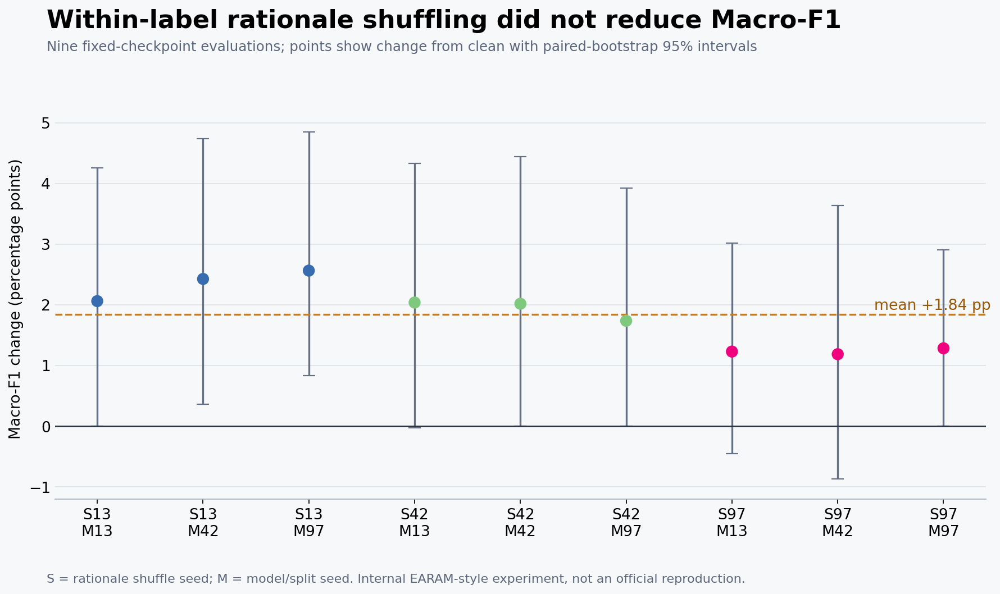

# When Do Rationales Help? A Reliability Stress Test of EARAM-Style Fake-News Detection

## English summary

**Question.** Does an EARAM-style detector benefit from sample-specific LVLM rationales, or mainly
from label-associated patterns in those rationales?

**Setup.** We used the 2,558 MR2 training examples for which both public EARAM rationale files are
available. We created stratified 80/10/10 internal splits for model seeds 13, 42, and 97. Frozen
CLIP-Large token features enabled the released VLR architecture to run on an RTX 5060 Laptop GPU
with 8 GB VRAM. Every intervention was evaluated with the corresponding clean checkpoint fixed.

The decisive control moved both rationale channels together to a different sample with the same
binary label. Three fixed-point-free permutations were evaluated against all three checkpoints.

| Condition | Mean test Macro-F1 | Change from clean |
|---|---:|---:|
| Clean rationales | 0.9333 | — |
| Within-label shuffled rationale pairs | 0.9517 | +0.0184 |

**Finding.** Same-label shuffling did not reduce mean Macro-F1. This contradicts a simple reading
of our earlier unrestricted-shuffle pilot: that earlier drop cannot be attributed to sample-level
semantic misalignment alone. Label-associated rationale signals are a plausible confound. The
positive mean change should not be generalized as an improvement because only 2 of 9 individual
paired-bootstrap 95% intervals were strictly above zero.

**Evidence.** The repository archives all nine prediction files, results, paired-bootstrap outputs,
runtime manifests, cache manifests, and fixed-point-free donor manifests. The bootstrap outputs were
independently regenerated from the archived predictions and matched exactly.

**Boundary.** This is a low-memory EARAM-style internal experiment, not an official-score
reproduction. The public repository lacks the second official MR2 test rationale, and our internal
split and cached-feature execution differ from the paper's evaluation. The experiment also does not
show that rationales are generally useless; it isolates one specific notion of sample correspondence.

## 中文摘要

**问题。** EARAM-style 检测器究竟受益于与当前样本语义对应的 LVLM rationale，还是主要使用
rationale 中与类别相关的模式？

**实验。** 我们使用两份公开 rationale 均齐全的 2,558 条 MR2 训练数据，按 13、42、97 三个
随机种子构造分层 80/10/10 内部划分。在 8 GB RTX 5060 Laptop GPU 上冻结 CLIP-Large，并用
缓存特征运行公开 VLR 架构。所有扰动条件均固定对应的 clean checkpoint。

关键对照实验把两条 rationale 一起移动给同标签的另一条样本，并保证没有任何样本仍收到
自己的 rationale。三个 shuffle 种子与三个模型种子组成九次评估。

**结果。** Clean rationale 的平均 Macro-F1 为 0.9333；同标签内部 shuffle 后为 0.9517，平均
变化 +0.0184。只有 2/9 个单次 paired-bootstrap 95% 区间严格高于 0，因此不能把这一正向
变化宣传成普遍性能提升。

**结论。** 保留标签信息、破坏样本级语义对应关系并未降低性能。因此，早期 unrestricted
shuffle 实验中的下降不能仅归因于语义错配，标签相关信号是一个合理的混杂因素。这也不等于
“rationale 没有用”，而是说明当前实验尚未证明模型依赖样本级语义对齐。

**边界。** 这是内部低显存 EARAM-style 实验，不是论文官方结果复现：公开仓库缺少第二份
MR2 官方测试 rationale，且内部划分和缓存执行路径与论文评测不同。仓库已归档全部九次预测、
结果、bootstrap 输出和 provenance manifests，可从原始文件重建本页结论。
